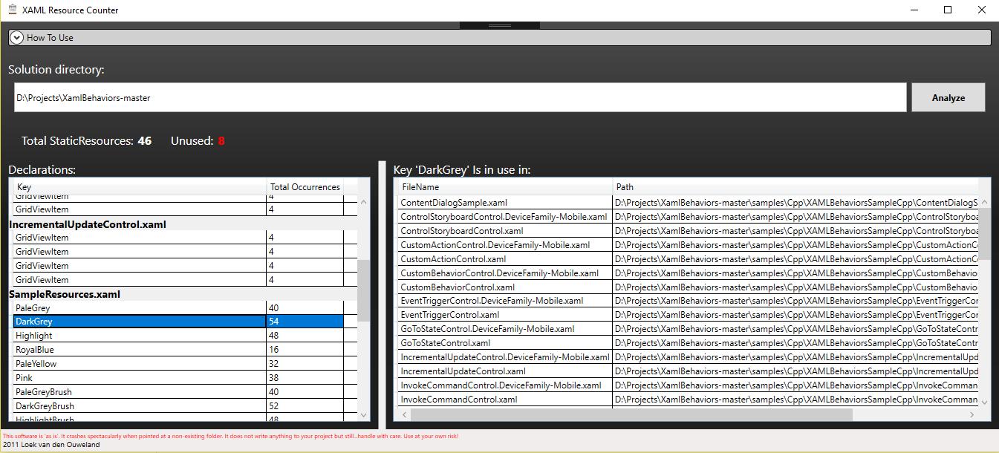

# ResourceCounter
App that checks for unused resources in XAML

# Usage
Write full path of WPF/Silverlight solution, and click the "Analyze" button.

# Warning
The app is looking for resources by iterating through files and utilizing a regex. 
keep in mind that it might be inaccurate sometimes!

# Screenshot

